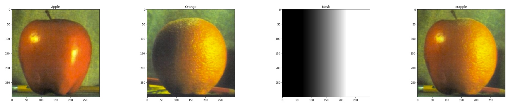
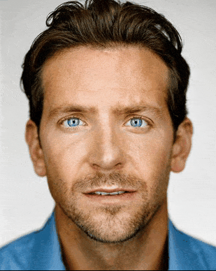
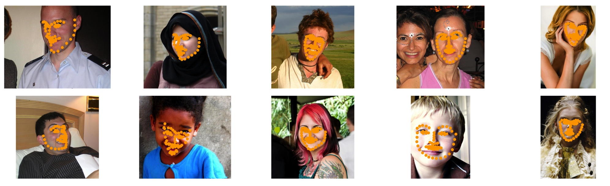
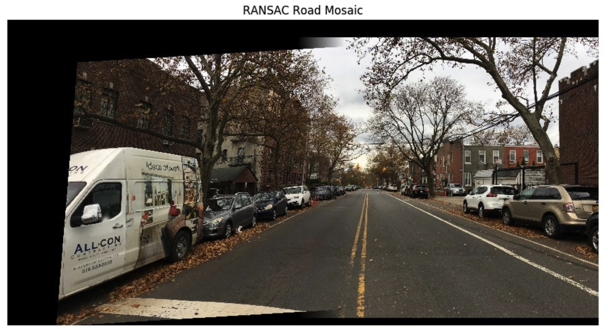

# Intro to Computer Vision and Computational Photography
## CS294-26
### Python 3.7

Final project pages for [CS294-26](https://inst.eecs.berkeley.edu/~cs194-26/fa20/) projects at UC Berkeley
Explicit code has been excluded in compliance with university copyright policy.

[Images of the Russian Empire -- colorizing the Prokudin-Gorskii photo collection](https://emaadkhwaja.github.io/Computer-Vision-and-Computational-Photography/emaad_khwaja_proj1_report/index.html)

"The goal of this assignment is to take the digitized Prokudin-Gorskii glass plate images and, using image processing techniques, automatically produce a color image with as few visual artifacts as possible. In order to do this, you will need to extract the three color channel images, place them on top of each other, and align them so that they form a single RGB color image."

[Fun with Filters and Frequencies](https://emaadkhwaja.github.io/Computer-Vision-and-Computational-Photography/emaad_khwaja_proj_2/index.html)

"The goal of this part of the assignment is to blend two images seamlessly using a multi resolution blending as described in the 1983 paper by Burt and Adelson. An image spline is a smooth seam joining two image together by gently distorting them. Multiresolution blending computes a gentle seam between the two images seperately at each band of image frequencies, resulting in a much smoother seam."

[Face Morphing and Modelling a Photo Collection](https://emaadkhwaja.github.io/Computer-Vision-and-Computation-Photography/emaad_khwaja_proj_3/index.html)

"In this assignment you will produce a "morph" animation of your face into someone else's face, compute the mean of a population of faces and extrapolate from a population mean to create a caricature of yourself."

[Face Keypoint Detection with Neural Networks](https://emaadkhwaja.github.io/Computer-Vision-and-Computation-Photography/emaad_khwaja_proj_4/index.html)

"In this project, you will learn how to use neural networks to automatically detect facial keypoints -- no more clicking!"

[(Auto)stitching and photo mosaics](https://emaadkhwaja.github.io/Computer-Vision-and-Computation-Photography/emaad_khwaja_proj_5/index.html)

"This project is all about stitching together many photographs to create larger composite images... In the first part, you will capture source photographs, define correspondences between them, and then warp and composite them. A detailed description of the requirements and scoring is given here. In the second part, you will automate the correspondence-finding portion of Part 1 so that you can create the panoramas automatically. A detailed description of the requirements and scoring for this part are given here."

